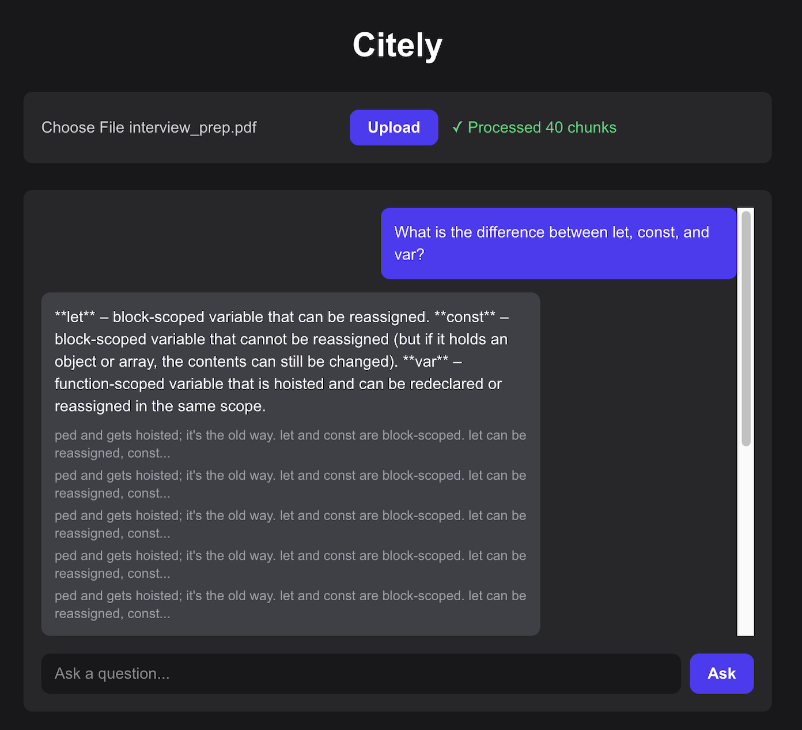

# 📄 Citely

A RAG-based document Q&A assistant — upload a PDF, ask questions about it, and get grounded answers with source citations instead of hallucinated guesses.

🔗 **[Live Demo](https://citely-ecru.vercel.app/)**
🔗 **[Backend API](https://citely-ttdr.onrender.com/)**

> **Note:** The backend runs on Render's free tier, which has limited CPU and spins down after inactivity. Uploading a document or asking a question can take anywhere from several seconds to a few minutes, especially after idle periods. This is a known limitation of free-tier hosting, not the application logic itself.

---

## ✨ Features

- Upload a PDF and have it automatically chunked, embedded, and stored in a vector database
- Ask natural-language questions about the uploaded document and get an AI-generated answer
- Answers are **grounded in the document** — if the answer isn't in the uploaded content, the assistant says "I don't know" instead of hallucinating
- Every answer comes with **source citations** — the actual text chunks used to generate the response are shown alongside it
- Clean, dark-themed chat interface with a message history for the current session

> **Known limitation:** Retrieval works best for specific, single-topic questions (e.g. "What is the difference between let and const?"). Broad, whole-document questions (e.g. "list every language covered in this document") are less reliable, since the system retrieves a fixed number of the most relevant chunks rather than reading the entire document — a known trade-off of chunk-based RAG rather than a bug in the retrieval logic itself.

---

## 🛠️ Technologies

- **Frontend:** Next.js (App Router), React, TypeScript, Tailwind CSS
- **Backend:** FastAPI (Python)
- **Vector Database:** ChromaDB, using its built-in ONNX-based `DefaultEmbeddingFunction` for embeddings
- **LLM:** Groq API (`openai/gpt-oss-20b`)
- **PDF Parsing:** pypdf
- **Deployment:** Frontend on Vercel, Backend on Render

---

## 📸 Preview



---

## 🚀 Getting Started

### Prerequisites
- Node.js 18+
- Python 3.10+
- A Groq API key (free at [console.groq.com](https://console.groq.com))

### Backend Setup

```bash
cd backend
python3 -m venv venv
source venv/bin/activate  # Windows: venv\Scripts\activate
pip install -r requirements.txt
```

Create a `.env` file in `backend/`:

```
GROQ_API_KEY=your_groq_api_key_here
```

Run the backend:

```bash
uvicorn main:app --reload
```

Open `http://127.0.0.1:8000/docs` to explore the API via Swagger UI.

### Frontend Setup

```bash
cd frontend
npm install
```

Create a `.env.local` file in `frontend/`:

```
NEXT_PUBLIC_API_URL=http://127.0.0.1:8000
```

Run the frontend:

```bash
npm run dev
```

Open `http://localhost:3000` in your browser.

---

## 🎮 Usage

1. Choose a PDF file and click **Upload** — the document is chunked, embedded, and stored
2. Type a question about the document's content and click **Ask**
3. The assistant responds with an answer grounded in the document, along with the source chunks it used
4. Ask something not covered in the document — the assistant will say it doesn't know, rather than making something up

---

## 📚 What I Learned

- Building a full RAG (Retrieval-Augmented Generation) pipeline from scratch: chunking, embedding, vector storage, retrieval, and grounded generation
- Designing a chunking strategy with overlap to avoid splitting sentences across chunks
- Using ChromaDB for both vector storage/similarity search and embedding generation via its built-in ONNX embedding function
- Writing prompts that explicitly constrain the LLM to the provided context, preventing hallucinated answers on out-of-scope questions
- Debugging CORS from both sides — understanding why the browser blocks cross-origin requests without an explicit `Access-Control-Allow-Origin` header, and configuring `CORSMiddleware` correctly for both local and production origins
- Hitting a memory-limited deploy failure on Render's free tier after initially trying `sentence-transformers` for embeddings, and resolving it by switching entirely to ChromaDB's lightweight built-in ONNX embedding function — a practical lesson in fitting ML dependencies to hosting constraints
- Managing environment-specific configuration (API URLs) across local development and split deployments (Vercel for frontend, Render for backend)

---

## 🔮 Future Improvements

- [ ] Improve retrieval for broad/summarization-style questions — e.g. by detecting when a query needs whole-document context and adjusting the retrieval strategy accordingly, rather than always retrieving a fixed number of chunks
- [ ] Handle the edge case where document text is shorter than the chunk overlap size (currently produces zero chunks)
- [ ] Split chunks along section/heading boundaries instead of a fixed character count, so related content doesn't get split across unrelated topics
- [ ] Persist uploaded documents across sessions (currently reset when the backend restarts on free-tier hosting)
- [ ] Add multi-document support instead of a single shared collection
- [ ] Add loading states in the UI while waiting for upload/answer responses
- [ ] Add tests for chunking, retrieval, and the hallucination guard
